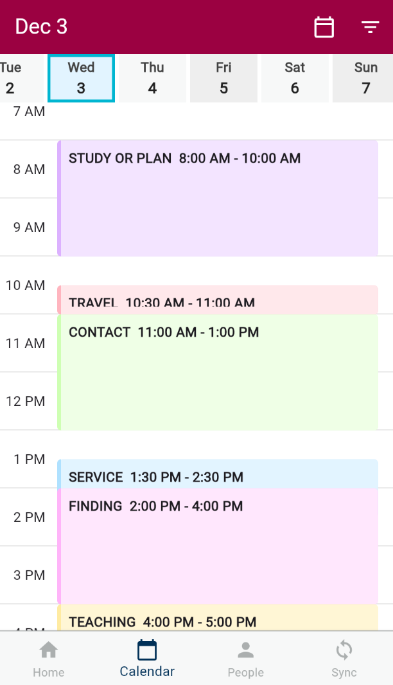
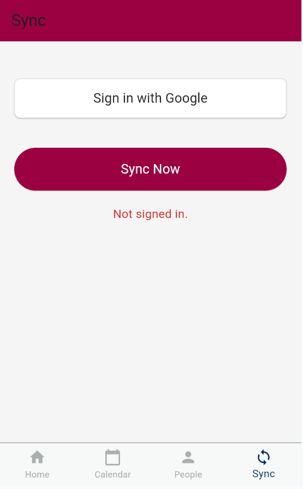

Demo images:

<table>
  <tr>
    <td></td>
    <td></td>
  </tr>
  <tr>
    <td align="center">Main calendar view</td>
    <td align="center">Syncing ... sign into your Google account, and sync to pull your google calendar</td>
  </tr>
</table>

Missionaries use the "Preach my Gospel" app (formerly known as areabook) to plan their day. Every. Single. Day. They come home and want to continue planning their day in the same way with a familiar tool they've grown to love over the past years.

Many people talk about making an app like it that RM's can use. A few tech savey RMs have tried, but it's a lot more work than they expected. I tried a while ago, but got too busy. Since then, people have been asking about how the apps been coming, and in truth I haven't been working on it. However, I picked up the project again just recently, and with the help of ChatGPT, I was able to make substantial progress with Flutter. I also had some ideas to make the project less daunting by reducing the scope.

A couple design principles are guiding this project:
1) I want it to LOOK AND FEEL AS SIMILAR to the PMG app as possible.
2) I want it to have the most limited ammount of features possible while maintaining usability in day-to-day planning. For example, I don't want the week view, just the day view is fine. No need for a map. No need for a people section. No need for key indicators or any other statistics or todo app like things. I just want a calendar that meets principle 1. The fancey features can come later.
3) There will be NO server. I am planning to use Google Calendar, and have all the UI actions make callbacks to the Google Calendar API. The sync tab will allow users to sign in with google, but WILL NOT save info about a user. It will just allow us to make google calendar API calls. Thats it.
4) Pull requests are welcomed! If you want to chat, raise an issue and we'll discuss it.

In short. I don't want this to become a piece of half-working bloatware that so much of the software we use today is. I want it to be clean, fast, and minimal while giving RM's a familiar and pleasant experience.